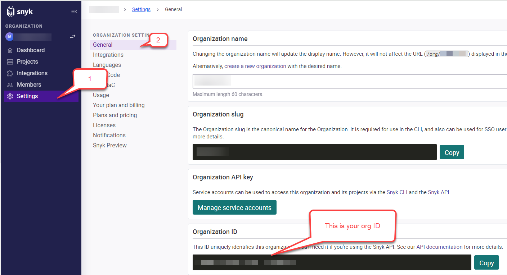

<h1> Automation Tool Prerequisites and Doco </h1>
Login or sign up to snyk.io on the VM
Grab organisation ID, you will need it to run snyk scan, the results will be emailed to the address you have used during registration to snyk.io

Run the following command : 
rm -r ~/.bashrc
nano ~/.bashrc
Ctrl+O, Enter Ctrl +X

<h2>To run the tool</h2>
./tools.sh
If error: zsh: permission denied: ./tool.sh
Run: 
chmod +x tools.sh
<h2>What to expect</h2>
The first time when tool runs it will check if tools installed if not, it will install the tools required to install the scanners and then install the scanner, if it’s already installed it will take you to the menu where you select which tool to run

