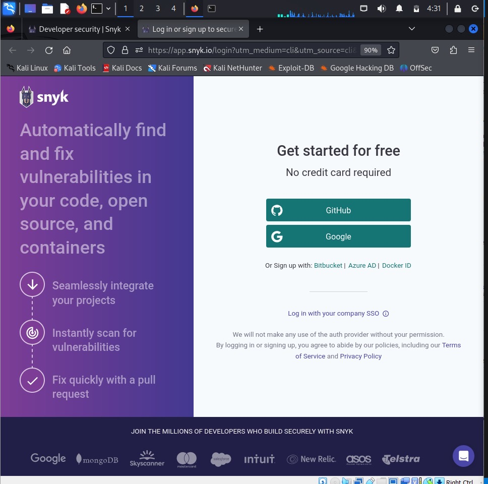
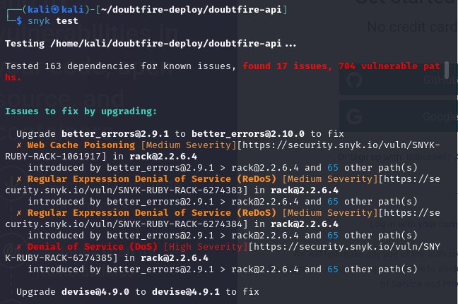
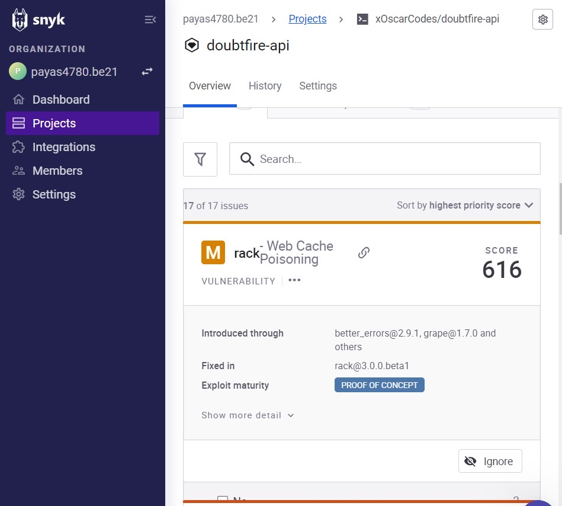

# Introduction

Snyk.io is a powerful software composition analysis (SCA) tool that helps you discover, prioritize, and remediate vulnerabilities within your open-source dependencies and container images. This guide will walk you through the steps of installing the Snyk CLI and integrating it into your development workflow to enhance your project's security posture.

## Prerequistes

Node.js and npm (or Yarn): Snyk's CLI is based on Node.js. Ensure you have Node.js (version 12 or later recommended) and npm installed on your system. You can download Node.js from the official website (https://nodejs.org/).
A Snyk.io account: Create a free account on the Snyk.io website (https://snyk.io). 

## Step 1: Installation  

Open a terminal window.
Install the Snyk CLI globally using npm (Node Package Manager): 
```bash 
npm install -g snyk 
```

## Step 2: Authenticate Snyk CLI
1. Run the following command in the terminal:
```bash 
snyk auth 
```
---


You will be prompted to open a URL in your browser to authenticate. Open the URL and follow the instructions.
After authenticating, you should see a message confirming that you've successfully authenticated.

---

__________________________________________________________


## Step 3: Verify Installation
Run command 
```bash 
snyk - -version 
```
---

----------------------------------- 

## Step 4: Navigate to your Project's Root Directory 

```bash
cd your-project-directory
```
_________________________________________


## Step 5 : Initiate a scan for testing the snyk CLI: 
1. After navigating to your project directory in terminal 
```bash
snyk test 
```
---

This command will test a project in the current directory for vulnerabilities
____________________________________________________________

#### Manual Specification: 
```bash
snyk test --package-manager=npm 
```
____________________________________________________________


 
#### Step 6 : Understanding the Results 
Snyk's scan results will provide:

1. List of Vulnerabilities: A detailed list of identified vulnerabilities, along with their severity levels.

2. Fix Recommendations: Upgrade paths or patches to help you fix the vulnerabilities.

3. Prioritization: Snyk prioritizes vulnerabilities based on their severity, exploitability, and availability of fixes.
____________________________________________________________


#### Step 7: Monitor Vulnerabilities 
1. To monitor your project for new vulnerabilities, run the following command:
```bash 
 snyk monitor 
 ```
 ---
 

This will monitor your project for new vulnerabilities and notify you if any are found. 

#### Best Practices 
1. Make Snyk scans a regular part of your development process.
2. Prioritize fixing vulnerabilities, especially those marked high-severity.
3. nUse Snyk monitoring for continuous protection.
4. Consider creating automatic fix pull requests in supported integrations.

---

<footer>
  <p>Learning Resources compiled by App Attack SCR Team Lead (Tl -2024): <a href="https://github.com/Payas009">Payas Paul</a>.</p>
</footer>
